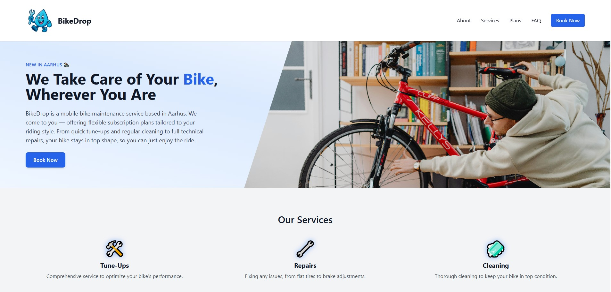
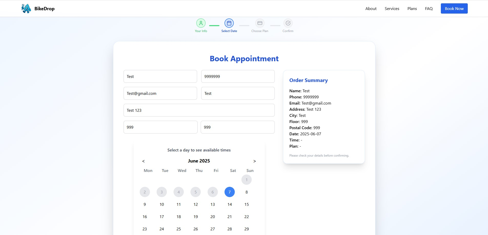

# 🚲 BikeDrop

**BikeDrop** is a mobile bicycle maintenance service based in Aarhus, Denmark.  
We bring expert bike care straight to your doorstep — from quick tune-ups and cleaning to full technical repairs.

This project includes a fully functional web platform for customers to **book appointments**, **track their bike's status**, and for admins to **manage reservations** efficiently.

---

## 📸 Screenshots

### Main Page


---

### Appointment Page



---

## 🛠 Tech Stack

- 🎨 **Frontend**: React + Tailwind CSS (located in `/client`)
- ⚙️ **Backend**: Node.js + Express + SQLite (located in `/server`)
- 🌐 **API communication** via REST endpoints

---

## 🔍 Features

- 📅 Interactive calendar with real-time slot availability  
- 🛎️ Booking form with services, notes, and customer details  
- ⚙️ Admin panel to filter, update, and delete reservations  
- 📈 Responsive and animated UI with Framer Motion  
- ✉️ Confirmation feedback via Toast notifications  
- 🌍 Timezone-aware for Europe/Copenhagen

---

## 🚀 Run the project locally

### 1. Clone the repository
```bash
git clone https://github.com/PAINj9/bikedrop.git
cd bikedrop
```

### 2. Start the backend
```bash
cd server
npm install
node index.js
```
Backend will run on: [http://localhost:5000](http://localhost:5000)

### 3. Start the frontend
Open a new terminal tab:
```bash
cd client
npm install
npm run dev
```
Frontend will run on: [http://localhost:5173](http://localhost:5173)

---

## 📬 Contact

📧 **Email**: juancruzastradaduran80@gmail.com
📍 **Location**: Aarhus, Denmark
🔗 **Instagram** @PAINj9 

---

## 💡 About

BikeDrop was born out of the need to make bike maintenance easier, faster, and more convenient for everyday cyclists.  
Whether you're a commuter, student, or weekend explorer — we take care of your bike right where you are, so you can keep riding without worry.
